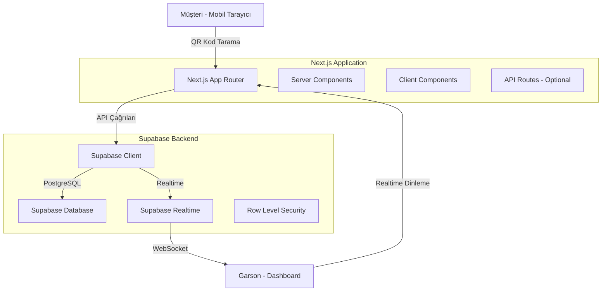

# Tasarım Dokümanı

## Genel Bakış

QR Menü ve Garson Çağırma Sistemi, Next.js 14+ App Router mimarisi üzerine inşa edilmiş, Supabase backend'i kullanan ve Tailwind CSS ile stillendirilmiş bir SaaS MVP uygulamasıdır. Sistem, müşterilerin QR kod ile menüye erişmesini ve garson çağırmasını sağlarken, garsonların da gerçek zamanlı olarak talepleri yönetmesini mümkün kılar.

## Mimari

### Genel Mimari Yapı



### Teknoloji Katmanları

1. **Frontend Layer**: Next.js 14+ App Router, React Server Components, Client Components
2. **Styling Layer**: Tailwind CSS, Lucide-React Icons
3. **Backend Layer**: Supabase (PostgreSQL, Realtime, Auth)
4. **Data Layer**: PostgreSQL veritabanı, RLS politikaları

### Routing Yapısı

```
app/
├── [slug]/
│   └── [tableId]/
│       └── page.jsx          # Müşteri menü sayfası (Public)
├── admin/
│   └── dashboard/
│       └── page.jsx          # Garson paneli (Protected)
├── layout.jsx                # Root layout
└── globals.css               # Tailwind CSS
```

## Bileşenler ve Arayüzler

### 1. Supabase Client (`lib/supabase.js`)

**Amaç**: Supabase ile iletişim kurmak için merkezi istemci oluşturma

**Yapı**:
```javascript
import { createClient } from '@supabase/supabase-js'

const supabaseUrl = process.env.NEXT_PUBLIC_SUPABASE_URL
const supabaseAnonKey = process.env.NEXT_PUBLIC_SUPABASE_ANON_KEY

export const supabase = createClient(supabaseUrl, supabaseAnonKey)
```

**Özellikler**:
- Environment variables kullanımı
- Singleton pattern (tek instance)
- Hem server hem client tarafında kullanılabilir

### 2. Müşteri Menü Sayfası (`app/[slug]/[tableId]/page.jsx`)

**Amaç**: Müşterilere dijital menü sunmak ve hizmet talebi oluşturmalarını sağlamak

**Bileşen Hiyerarşisi**:
```
MenuPage (Server Component)
├── MenuHeader (Client Component)
│   ├── RestaurantLogo
│   └── TableNumber
├── CategoryTabs (Client Component)
│   └── CategoryTab[]
├── ProductList (Client Component)
│   └── ProductCard[]
│       ├── ProductImage
│       ├── ProductInfo
│       └── PriceTag
└── FloatingActionButton (Client Component)
    └── ServiceRequestModal
        ├── CallWaiterButton
        └── RequestBillButton
```

**Veri Akışı**:
1. Server Component: `slug` ve `tableId` parametrelerini alır
2. Supabase'den restoran, masa ve menü verilerini çeker
3. Client Component'lere props olarak iletir
4. Client Component'ler interaktif özellikleri yönetir

**State Yönetimi**:
- `selectedCategory`: Aktif kategori (useState)
- `isModalOpen`: Hizmet talebi modal durumu (useState)
- `isLoading`: Talep gönderme durumu (useState)

### 3. Garson Dashboard (`app/admin/dashboard/page.jsx`)

**Amaç**: Garsonların hizmet taleplerini gerçek zamanlı olarak görmesi ve yönetmesi

**Bileşen Hiyerarşisi**:
```
DashboardPage (Client Component)
├── DashboardHeader
│   ├── Title
│   └── RefreshButton
├── RequestList
│   └── RequestCard[]
│       ├── TableInfo
│       ├── RequestType
│       ├── Timestamp
│       └── CompleteButton
└── NotificationSystem
    ├── AudioNotification
    └── ToastNotification
```

**Realtime Entegrasyonu**:
```javascript
useEffect(() => {
  const channel = supabase
    .channel('service_requests')
    .on('postgres_changes', 
      { event: 'INSERT', schema: 'public', table: 'service_requests' },
      (payload) => {
        // Yeni talep geldiğinde
        setRequests(prev => [payload.new, ...prev])
        playNotificationSound()
        showToast('Yeni talep!')
      }
    )
    .subscribe()

  return () => {
    supabase.removeChannel(channel)
  }
}, [])
```

**State Yönetimi**:
- `requests`: Bekleyen talepler listesi (useState)
- `isConnected`: Realtime bağlantı durumu (useState)

### 4. UI Bileşenleri

**ProductCard**:
- Ürün görseli (Next.js Image ile optimize)
- Ürün adı ve açıklaması
- Fiyat etiketi
- Stok durumu göstergesi

**RequestCard**:
- Masa numarası badge
- Talep tipi ikonu (Lucide-React)
- Zaman damgası (relative time)
- Tamamla butonu

**FloatingActionButton**:
- Sabit konum (fixed bottom-right)
- Pulse animasyonu
- Modal tetikleyici

## Veri Modelleri

### Database Schema

```sql
-- Restaurants Table
CREATE TABLE restaurants (
  id UUID PRIMARY KEY DEFAULT uuid_generate_v4(),
  name TEXT NOT NULL,
  slug TEXT UNIQUE NOT NULL,
  logo_url TEXT,
  created_at TIMESTAMP WITH TIME ZONE DEFAULT NOW()
);

-- Tables Table
CREATE TABLE tables (
  id UUID PRIMARY KEY DEFAULT uuid_generate_v4(),
  restaurant_id UUID REFERENCES restaurants(id) ON DELETE CASCADE,
  table_number INTEGER NOT NULL,
  qr_code_uuid UUID UNIQUE DEFAULT uuid_generate_v4(),
  created_at TIMESTAMP WITH TIME ZONE DEFAULT NOW()
);

-- Categories Table
CREATE TABLE categories (
  id UUID PRIMARY KEY DEFAULT uuid_generate_v4(),
  restaurant_id UUID REFERENCES restaurants(id) ON DELETE CASCADE,
  name TEXT NOT NULL,
  sort_order INTEGER DEFAULT 0,
  created_at TIMESTAMP WITH TIME ZONE DEFAULT NOW()
);

-- Products Table
CREATE TABLE products (
  id UUID PRIMARY KEY DEFAULT uuid_generate_v4(),
  category_id UUID REFERENCES categories(id) ON DELETE CASCADE,
  name TEXT NOT NULL,
  description TEXT,
  price DECIMAL(10, 2) NOT NULL,
  image_url TEXT,
  is_available BOOLEAN DEFAULT TRUE,
  created_at TIMESTAMP WITH TIME ZONE DEFAULT NOW()
);

-- Service Requests Table
CREATE TABLE service_requests (
  id UUID PRIMARY KEY DEFAULT uuid_generate_v4(),
  table_id UUID REFERENCES tables(id) ON DELETE CASCADE,
  restaurant_id UUID REFERENCES restaurants(id) ON DELETE CASCADE,
  type TEXT CHECK (type IN ('CALL_WAITER', 'REQUEST_BILL')),
  status TEXT CHECK (status IN ('PENDING', 'COMPLETED')) DEFAULT 'PENDING',
  created_at TIMESTAMP WITH TIME ZONE DEFAULT NOW()
);

-- Indexes
CREATE INDEX idx_service_requests_status ON service_requests(status);
CREATE INDEX idx_service_requests_restaurant ON service_requests(restaurant_id);
CREATE INDEX idx_products_category ON products(category_id);
CREATE INDEX idx_categories_restaurant ON categories(restaurant_id);
```

### Row Level Security (RLS) Politikaları

```sql
-- Müşteriler menüyü görebilir (public read)
ALTER TABLE restaurants ENABLE ROW LEVEL SECURITY;
CREATE POLICY "Public can view restaurants" ON restaurants FOR SELECT USING (true);

ALTER TABLE categories ENABLE ROW LEVEL SECURITY;
CREATE POLICY "Public can view categories" ON categories FOR SELECT USING (true);

ALTER TABLE products ENABLE ROW LEVEL SECURITY;
CREATE POLICY "Public can view products" ON products FOR SELECT USING (true);

-- Müşteriler hizmet talebi oluşturabilir
ALTER TABLE service_requests ENABLE ROW LEVEL SECURITY;
CREATE POLICY "Anyone can create service requests" ON service_requests FOR INSERT WITH CHECK (true);

-- Sadece admin/garson talepler görebilir ve güncelleyebilir
CREATE POLICY "Admin can view service requests" ON service_requests FOR SELECT USING (true);
CREATE POLICY "Admin can update service requests" ON service_requests FOR UPDATE USING (true);
```

### TypeScript Tipleri (Opsiyonel)

```typescript
type Restaurant = {
  id: string
  name: string
  slug: string
  logo_url: string | null
}

type Table = {
  id: string
  restaurant_id: string
  table_number: number
  qr_code_uuid: string
}

type Category = {
  id: string
  restaurant_id: string
  name: string
  sort_order: number
}

type Product = {
  id: string
  category_id: string
  name: string
  description: string | null
  price: number
  image_url: string | null
  is_available: boolean
}

type ServiceRequest = {
  id: string
  table_id: string
  restaurant_id: string
  type: 'CALL_WAITER' | 'REQUEST_BILL'
  status: 'PENDING' | 'COMPLETED'
  created_at: string
}
```

## Hata Yönetimi

### Client-Side Hata Yönetimi

**Stratejiler**:
1. Try-catch blokları ile API çağrılarını sarmalama
2. Error boundary bileşenleri (Next.js error.jsx)
3. Toast/Alert ile kullanıcı dostu hata mesajları
4. Loading states ile kullanıcı bilgilendirme

**Örnek Hata Senaryoları**:
- Supabase bağlantı hatası → "Bağlantı kurulamadı, lütfen tekrar deneyin"
- Geçersiz QR kod → "Geçersiz masa kodu"
- Realtime bağlantı kopması → "Bağlantı kesildi, yeniden bağlanılıyor..."

### Server-Side Hata Yönetimi

**Stratejiler**:
1. Supabase sorgu hatalarını yakalama
2. 404 sayfası (not-found.jsx) için geçersiz slug/tableId
3. 500 sayfası (error.jsx) için beklenmeyen hatalar

## Test Stratejisi

### Unit Tests

**Test Edilecek Bileşenler**:
- Supabase client oluşturma
- Veri dönüşüm fonksiyonları (fiyat formatlama, tarih formatlama)
- UI bileşenlerinin render edilmesi

**Araçlar**: Jest, React Testing Library

### Integration Tests

**Test Senaryoları**:
- Menü sayfasının doğru veriyle yüklenmesi
- Hizmet talebi oluşturma akışı
- Dashboard'da talep güncelleme akışı
- Realtime bağlantı kurulması

**Araçlar**: Playwright veya Cypress

### E2E Tests

**Kritik Akışlar**:
1. Müşteri QR kod tarar → Menü görür → Garson çağırır
2. Garson dashboard açar → Yeni talep gelir → Talebi tamamlar

**Araçlar**: Playwright

### Manual Testing Checklist

- [ ] Mobil cihazlarda responsive tasarım
- [ ] Farklı tarayıcılarda uyumluluk (Chrome, Safari, Firefox)
- [ ] Realtime bildirimlerin çalışması
- [ ] Ses bildiriminin çalması
- [ ] Yavaş internet bağlantısında performans

## Performans Optimizasyonları

### Next.js Optimizasyonları

1. **Server Components**: Mümkün olduğunca server component kullanımı
2. **Image Optimization**: Next.js Image bileşeni ile otomatik optimizasyon
3. **Code Splitting**: Dinamik import ile lazy loading
4. **Caching**: Supabase sorgularında cache stratejileri

### Supabase Optimizasyonları

1. **Selective Queries**: Sadece gerekli kolonları çekme
2. **Indexes**: Sık sorgulanan alanlara index ekleme
3. **Connection Pooling**: Supabase otomatik yönetir
4. **Realtime Filters**: Sadece ilgili restaurant_id için dinleme

### Tailwind CSS Optimizasyonları

1. **Purge CSS**: Production build'de kullanılmayan stilleri temizleme
2. **JIT Mode**: Just-in-Time compilation
3. **Custom Utilities**: Tekrar eden stiller için utility class'lar

## Güvenlik Önlemleri

### Supabase RLS

- Tüm tablolarda Row Level Security aktif
- Public read, restricted write politikaları
- Admin işlemleri için authentication kontrolü

### Environment Variables

- API anahtarları `.env.local` dosyasında
- `.env.local` dosyası `.gitignore`'a eklenmeli
- Production'da Vercel/Netlify environment variables kullanımı

### Input Validation

- Client-side: Form validasyonu
- Server-side: Supabase schema constraints
- XSS koruması: React otomatik escape eder

## Deployment Stratejisi

### Vercel Deployment (Önerilen)

1. GitHub repository'ye push
2. Vercel'e bağlama
3. Environment variables ekleme
4. Otomatik deployment

### Supabase Setup

1. Supabase projesi oluşturma
2. SQL şemasını çalıştırma
3. RLS politikalarını aktifleştirme
4. API keys'leri kopyalama

### Post-Deployment Checklist

- [ ] Environment variables doğru mu?
- [ ] Database migrations çalıştı mı?
- [ ] RLS politikaları aktif mi?
- [ ] Realtime çalışıyor mu?
- [ ] Mobil cihazlarda test edildi mi?
